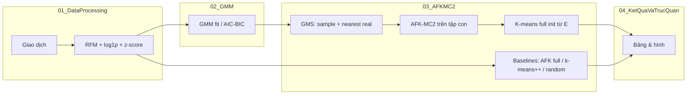
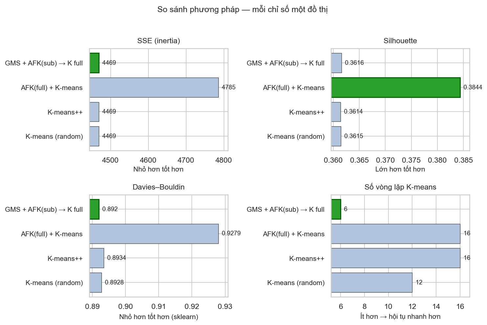
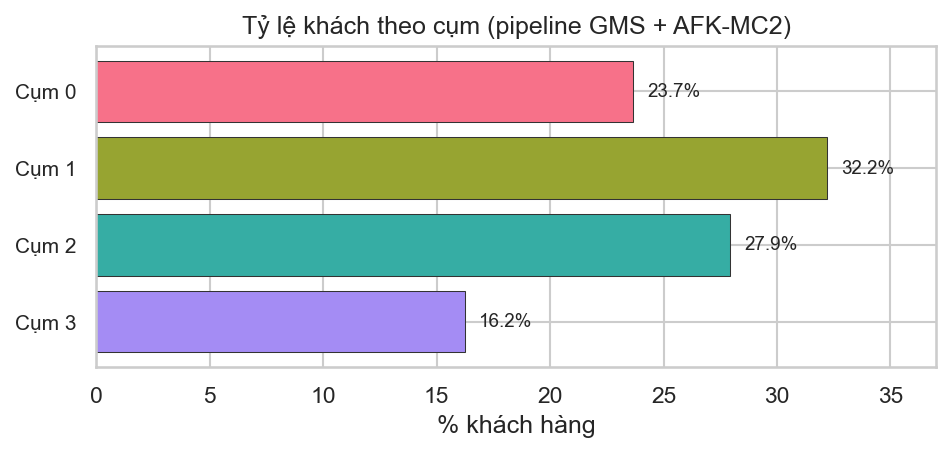
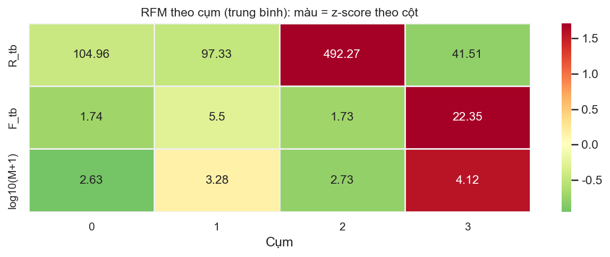
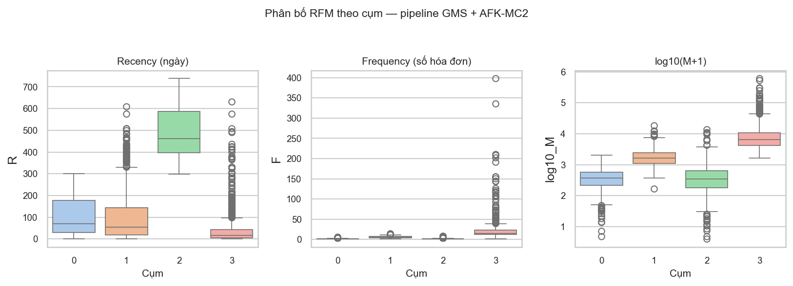
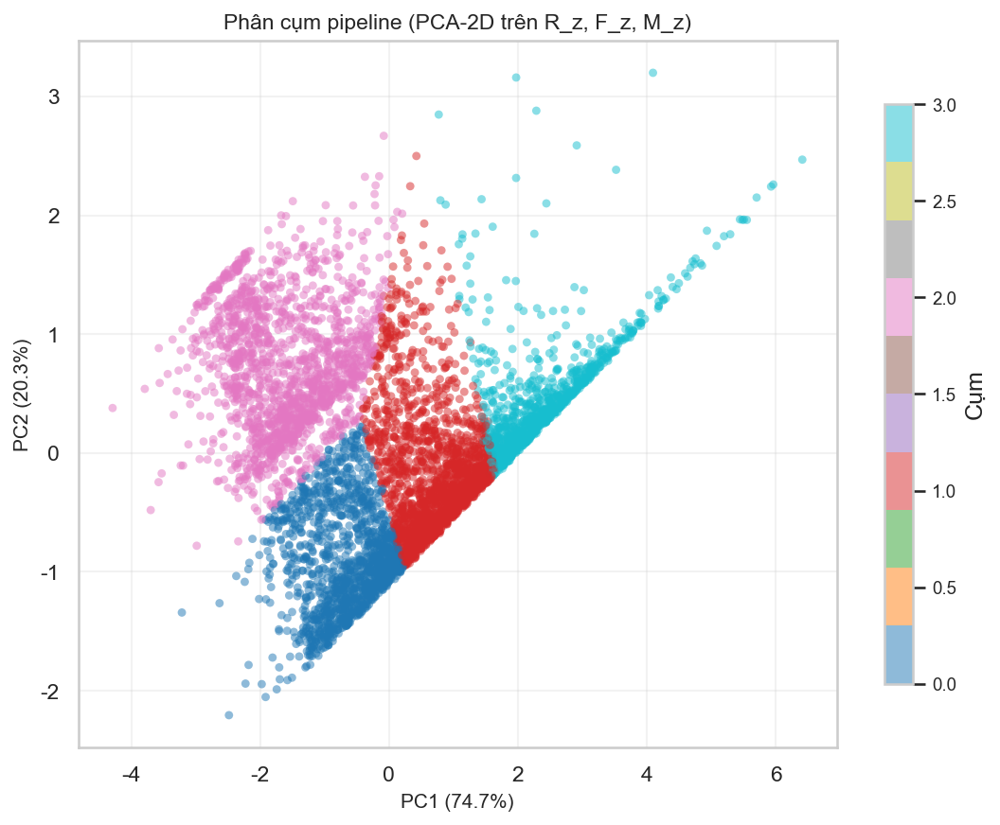
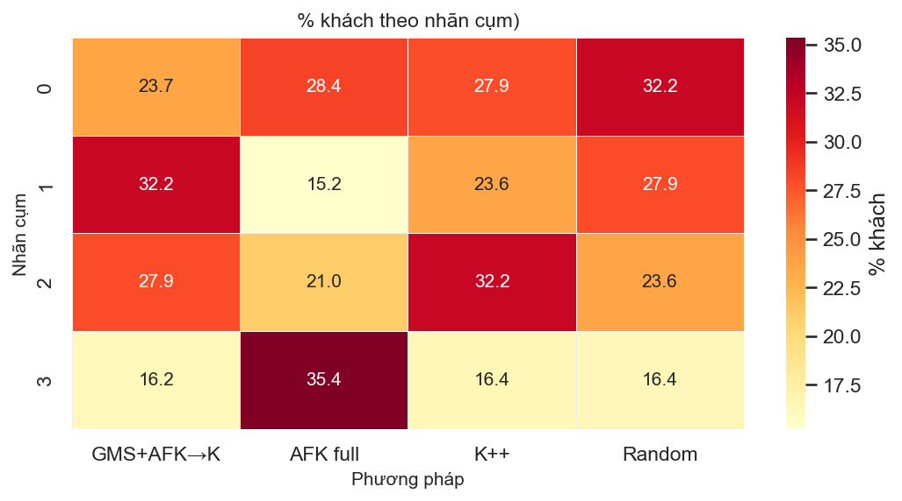

# Ứng dụng mô hình hỗn hợp Gaussian (GMM) trong phân cụm khách hàng

Dự án thực nghiệm trên dữ liệu **Online Retail II** (`online_retail_II.csv`): xây đặc trưng **RFM**, ước lượng phân phối bằng **GMM**, phân cụm bằng **K-means** với khởi tạo **AFK-MC2** và pipeline **GMS → AFK-MC2 (tập con) → K-means (toàn bộ)**.

---

## Mục lục (theo bố cục tiểu luận)

| § | Nội dung | Trong README |
|---|----------|----------------|
| 1 | Tóm tắt | [§1](#1-tóm-tắt) |
| 2 | Giới thiệu | [§2](#2-giới-thiệu) |
| 3 | Cơ sở lý thuyết *(ngắn) + **công thức dùng trong từng notebook*** | [§3](#3-cơ-sở-lý-thuyết-ngắn-và-công-thức-theo-notebook) |
| 4 | Phương pháp / pipeline | [§4](#4-phương-pháp-và-pipeline) |
| 5 | Thiết kế thực nghiệm | [§5](#5-thiết-kế-thực-nghiệm) |
| 6 | Chi tiết cài đặt | [§6](#6-chi-tiết-cài-đặt-và-cấu-trúc-notebook) |
| 7 | Kết quả & phân tích *(có hình)* | [§7](#7-kết-quả-và-phân-tích-hình-ảnh) |
| 8 | Thảo luận | [§8](#8-thảo-luận) |
| 9 | Kết luận | [§9](#9-kết-luận) |

**Hình minh họa:** chạy xong các notebook (đặc biệt [`notebooks/online_retail/04_KetQuaVaTrucQuan.ipynb`](notebooks/online_retail/04_KetQuaVaTrucQuan.ipynb)) để sinh file trong thư mục [`figures/`](figures/). Nếu chưa chạy, các ảnh dưới sẽ không hiển thị trong một số trình xem Markdown.

---

## 1. Tóm tắt

- **Bài toán:** phân cụm khách hàng theo hành vi mua (RFM) trên giao dịch thương mại điện tử.  
- **Công cụ:** GMM để học phân phối và **lấy mẫu tập con (GMS)**; **AFK-MC2** để khởi tạo tâm; **K-means (Elkan)** để phân cụm cuối.  
- **Dữ liệu:** ~5,9k khách sau tiền xử lý từ **Online Retail II** (khớp quy mô thường dùng trong tài liệu tương tự).  
- **So sánh:** pipeline GMS + AFK-MC2 (tập con) + K-means (full) với AFK-MC2 (full), K-means++, random init — theo SSE (inertia), Silhouette, Davies–Bouldin, số vòng lặp.

---

## 2. Giới thiệu

Phân khúc khách hàng hỗ trợ chiến lược marketing (ưu tiên nhóm giá trị cao, tái kích hoạt nhóm “ngủ đông”, …). **K-means** phụ thuộc **khởi tạo** và **chuẩn hóa đặc trưng**. **GMM** mô tả phân phối đa đỉnh trong không gian RFM đã chuẩn hóa; **AFK-MC2** (Bachem et al.) cung cấp seed có cơ sở lý thuyết tốt hơn random. Kết hợp **GMS** (lấy mẫu theo GMM rồi ánh xạ về điểm thật) giảm chi phí seeding trên toàn bộ tập và gần với pipeline trong tài liệu tham khảo kỹ thuật Gms–AFK-MC2.

---

## 3. Cơ sở lý thuyết (ngắn) và công thức theo notebook

Phần này chỉ nêu **đủ để nối với code**; không thay cho giáo trình đầy đủ về EM, MCMC, v.v.

### 3.1 Notebook `notebooks/online_retail/01_DataProcessing.ipynb` — RFM và chuẩn hóa

**Tiền xử lý dòng giao dịch**

- Giá trị dòng:  
  \[
  \text{LineTotal} = \text{Quantity} \times \text{Price}.
  \]
- Loại bỏ: thiếu `Customer ID`; hóa đơn hủy (mã `Invoice` bắt đầu bằng `C`); `Quantity \le 0` hoặc `Price \le 0`.

**RFM theo khách \(i\)** (sau khi gom nhóm theo `Customer ID`)

- Gọi \(t_{\mathrm{ref}} = \max(\text{InvoiceDate})\) trên tập đã làm sạch.  
- **Recency:**  
  \[
  R_i = \bigl(t_{\mathrm{ref}} - \max_{giao\,dịch\,của\,i} \text{InvoiceDate}\bigr)\ \text{theo ngày}.
  \]  
  *(R nhỏ → mua gần đây hơn.)*  
- **Frequency:**  
  \[
  F_i = \#\{\text{Invoice khác nhau của } i\}.
  \]  
- **Monetary:**  
  \[
  M_i = \sum_{\text{dòng thuộc } i} \text{LineTotal}.
  \]

**Biến đổi và z-score (dùng cho GMM / K-means sau này)**

- Log ổn định phân phối lệch:  
  \[
  F'_i = \log(1+F_i),\qquad M'_i = \log(1+M_i).
  \]  
- **StandardScaler** trên từng cột của \((R_i, F'_i, M'_i)\):  
  \[
  z = \frac{x - \mu}{\sigma}
  \]  
  (trung bình mẫu \(\mu\), độ lệch chuẩn mẫu \(\sigma\) theo cột).  
- Output: `data/rfm_customers.csv` với các cột `R, F, M`, `F_log1p`, `M_log1p`, `R_z`, `F_z`, `M_z`.

### 3.2 Notebook `notebooks/online_retail/02_GMM.ipynb` — hỗn hợp Gaussian

**Mô hình** (sklearn: `GaussianMixture`)

\[
p(\mathbf{x}) = \sum_{j=1}^{J} w_j \,\mathcal{N}(\mathbf{x} \mid \boldsymbol{\mu}_j, \boldsymbol{\Sigma}_j), \quad \sum_j w_j = 1.
\]

**Chọn số thành phần \(J\):** thử nhiều \(J\), so **AIC** / **BIC** (sklearn trả về sau khi fit). Có thể giới hạn \(J \le J_{\mathrm{cap}}\) để tránh quá nhiều thành phần khó diễn giải.

**Đầu vào:** ma trận \([\texttt{R\_z}, \texttt{F\_z}, \texttt{M\_z}]\).  
**Output:** `models/gmm_rfm.joblib`, `data/rfm_with_gmm.csv`, `data/gmm_model_selection.csv`.

### 3.3 Notebook `notebooks/online_retail/03_AFKMC2.ipynb` — GMS, AFK-MC2, K-means

**GMS (ánh xạ mẫu GMM → điểm thật)**  
Với mỗi mẫu \(\mathbf{s}\) sinh từ GMM đã fit, chọn chỉ số hàng \(\ell\) sao cho khoảng cách Euclidean có trọng số \(\boldsymbol{\omega}\) nhỏ nhất:

\[
\ell = \arg\min_{r} \left\| (\mathbf{x}_r - \mathbf{s}) \odot \boldsymbol{\omega} \right\|_2.
\]

Trong code mặc định \(\boldsymbol{\omega} = (1,1,1)^\top\). Tập con gồm \(n_{\mathrm{sample}} = \max\bigl(k, \lfloor \rho \cdot N \rfloor\bigr)\) điểm (tỷ lệ \(\rho =\) `SAMPLE_RATE`).

**AFK-MC2:** dùng package `afkmc2` — hàm `afkmc2.afkmc2(X_{\mathrm{sub}}, k, m)` trả về \(k\) tâm khởi tạo (Markov chain độ dài \(m\)).  
**Pipeline giống tinh thần paper:** AFK-MC2 trên **\(X_{\mathrm{sub}}\)** → các tâm đó làm `init` cho **K-means trên toàn bộ \(X\)** (`n_init=1`, `algorithm="elkan"`).  
*(Bước “AFK-MC2 lần 2 trên full” trong paper không có API tương ứng trong gói `afkmc2` đơn giản; Lloyd/Elkan với `init` cố định là cách thay thế phổ biến.)*

**K-means — SSE (inertia, sklearn)**  
\[
\mathrm{SSE} = \sum_{i} \left\| \mathbf{x}_i - \boldsymbol{\mu}_{c(i)} \right\|_2^2,
\]
với \(c(i)\) là cụm gán cho điểm \(i\), \(\boldsymbol{\mu}\) là tâm cụm.

**Output:** `data/kmeans_init_comparison.csv`, `data/rfm_with_kmeans_clusters.csv`.

### 3.4 Notebook `notebooks/online_retail/04_KetQuaVaTrucQuan.ipynb` — metric trực quan

- **Silhouette** (sklearn): đo mức độ “gắn” cụm của mình so với cụm láng giềng; **cao hơn** thường tốt hơn (trong khoảng \([-1,1]\)).  
- **Davies–Bouldin** (sklearn): **nhỏ hơn** tốt hơn.

Công thức đầy đủ xem [sklearn.metrics](https://scikit-learn.org/stable/modules/clustering.html#clustering-performance-evaluation).

---

## 4. Phương pháp và pipeline



---

## 5. Thiết kế thực nghiệm

| Hạng mục | Lựa chọn |
|----------|----------|
| Dữ liệu | `online_retail_II.csv` → khách hàng cấp RFM |
| Đặc trưng phân cụm | `R_z`, `F_z`, `M_z` |
| Số cụm K-means | `k = 4` (có thể đổi trong `notebooks/online_retail/03_AFKMC2.ipynb`) |
| GMM (GMS / NB2) | Ưu tiên load `models/gmm_rfm.joblib`; không có thì fit fallback |
| Tỷ lệ lấy mẫu GMS | `SAMPLE_RATE = 0.5` |
| AFK-MC2 | `m = 200` (chuỗi Markov) |
| So sánh | Pipeline GMS+AFK(sub)+K; AFK(full)+K; K-means++; random |

**Chỉ số:** SSE (inertia), Silhouette, Davies–Bouldin, `n_iter`.

---

## 6. Chi tiết cài đặt và cấu trúc notebook

**Môi trường:** Python 3; thư viện: `pandas`, `numpy`, `scikit-learn`, `matplotlib`, `seaborn`, `joblib`, `afkmc2`.

```bash
python3 -m pip install -r requirements.txt
```

**Thứ tự chạy**

1. `notebooks/online_retail/01_DataProcessing.ipynb` → `data/rfm_customers.csv`  
2. `notebooks/online_retail/02_GMM.ipynb` → `models/gmm_rfm.joblib`, `data/rfm_with_gmm.csv`, …  
3. `notebooks/online_retail/03_AFKMC2.ipynb` → `data/kmeans_init_comparison.csv`, `data/rfm_with_kmeans_clusters.csv`  
4. `notebooks/online_retail/04_KetQuaVaTrucQuan.ipynb` → bảng CSV bổ sung + **`figures/*.png`**

**Cấu trúc thư mục (chính)**

```
GMS_AFKMC2/
├── README.md
├── requirements.txt
├── online_retail_II.csv
├── notebooks/
│   └── online_retail/    # 01–04 Online Retail
├── data/                 # CSV đầu ra
├── models/
├── figures/
└── paper/
```

---

## 7. Kết quả và phân tích (hình ảnh)

### 7.1 So sánh phương pháp (metric)



### 7.2 Phân khúc theo pipeline chính (`kmeans_gms_afkmc2_pipeline`)

**Tỷ lệ khách theo cụm**



**Heatmap RFM (trung bình theo cụm; màu = z-score theo cột)**



**Phân bố R, F, log10(M+1) theo cụm**



**PCA-2D trên R_z, F_z, M_z**



### 7.3 Cơ cấu % khách theo nhãn cụm — bốn phương pháp



**Bảng dữ liệu (CSV, mở bằng Excel / pandas):**

- `data/bang_so_sanh_phuong_phap.csv`  
- `data/bang_profile_rfm_theo_cum.csv`  
- `data/bang_phan_tram_cum_theo_phuong_phap.csv`  

*(Chạy `notebooks/online_retail/04_KetQuaVaTrucQuan.ipynb` để cập nhật.)*

---

## 8. Thảo luận

- Trên tập **Online Retail II** đã chuẩn hóa, **SSE** của pipeline **GMS + AFK-MC2 (sub) + K-means (full)** thường **rất gần K-means++** và **random init** (nhiều cực tiểu địa phương tương đương).  
- **AFK-MC2 trực tiếp trên toàn bộ tập** có thể cho **SSE kém hơn rõ** — seed rơi cực tiểu khác; đồng thời Silhouette có thể cao hơn → cần nhìn **nhiều metric**, không chỉ SSE.  
- Pipeline qua **tập con** thường có **`n_iter` nhỏ hơn** → ít vòng Lloyd hơn sau khởi tạo.  
- **Hạn chế:** một khách hàng / RFM tại một mốc thời gian; không phản ánh xu hướng dài hạn; GMM/K phụ thuộc cấu hình; bước thứ hai của paper được **xấp xỉ** bằng K-means với `init` cố định.

---

## 9. Kết luận

Đề tài đã xây **chuỗi xử lý có thể tái lập**: RFM có công thức rõ → GMM → GMS → AFK-MC2 trên tập con → K-means trên toàn bộ, kèm **baseline** và **bảng/hình** phục vụ báo cáo. Hướng mở rộng: thử **k** và **SAMPLE_RATE** khác, dữ liệu/ quốc gia khác, hoặc bổ sung chỉ số nghiệp vụ ngoài RFM.

---

## Tài liệu trong repo

- Đề cương tiểu luận: [`paper/de_cuong_tieu_luan_gms_afkmc2.txt`](paper/de_cuong_tieu_luan_gms_afkmc2.txt)  
- Bài tham khảo kỹ thuật (Gms–AFK-MC2): [`paper/Gms-Afkmc2_A_New_Customer_Segmentation_Framework_B.pdf`](paper/Gms-Afkmc2_A_New_Customer_Segmentation_Framework_B.pdf)

---

*Tác giả / nhóm thực hiện: cập nhật README khi đổi tham số hoặc thêm notebook.*
