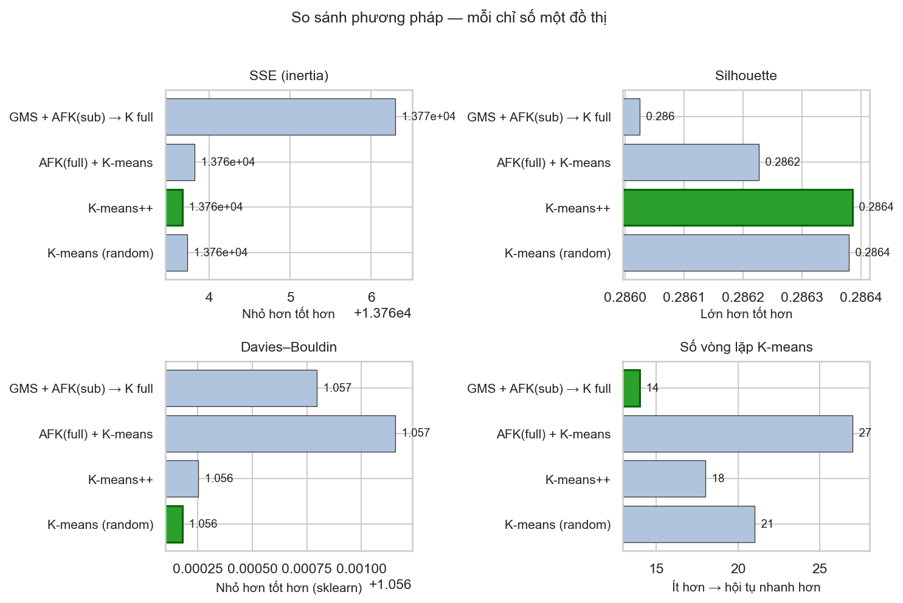
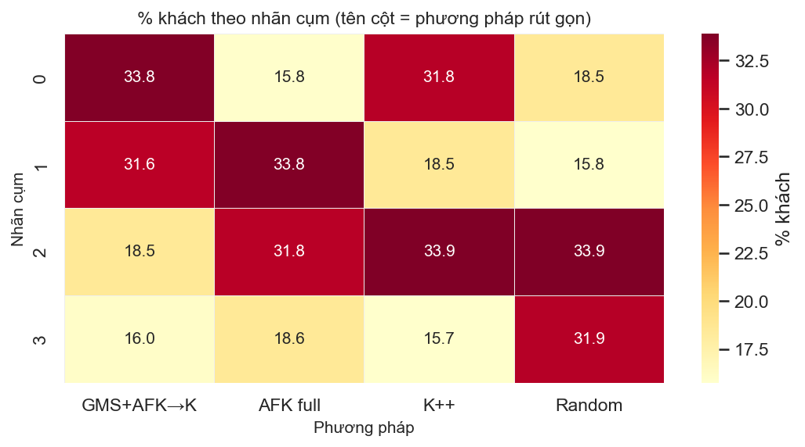
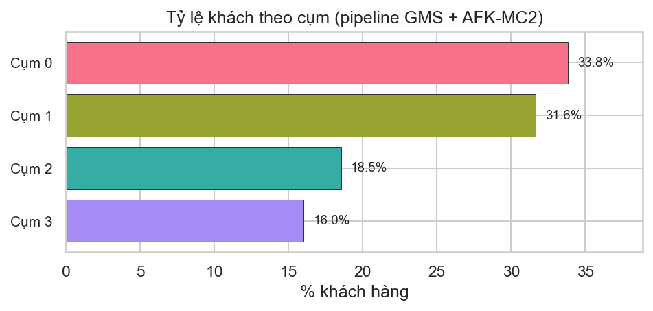
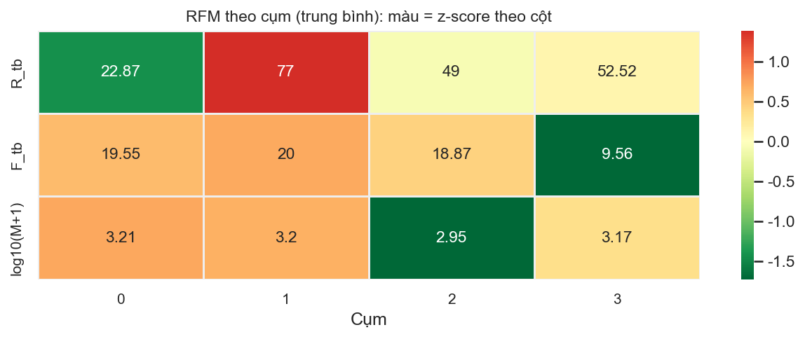
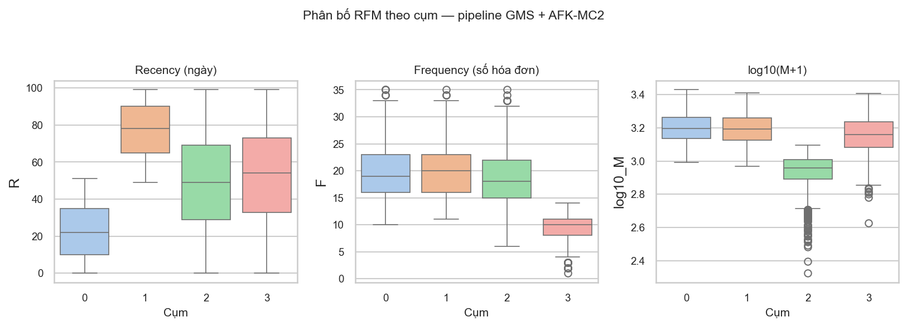
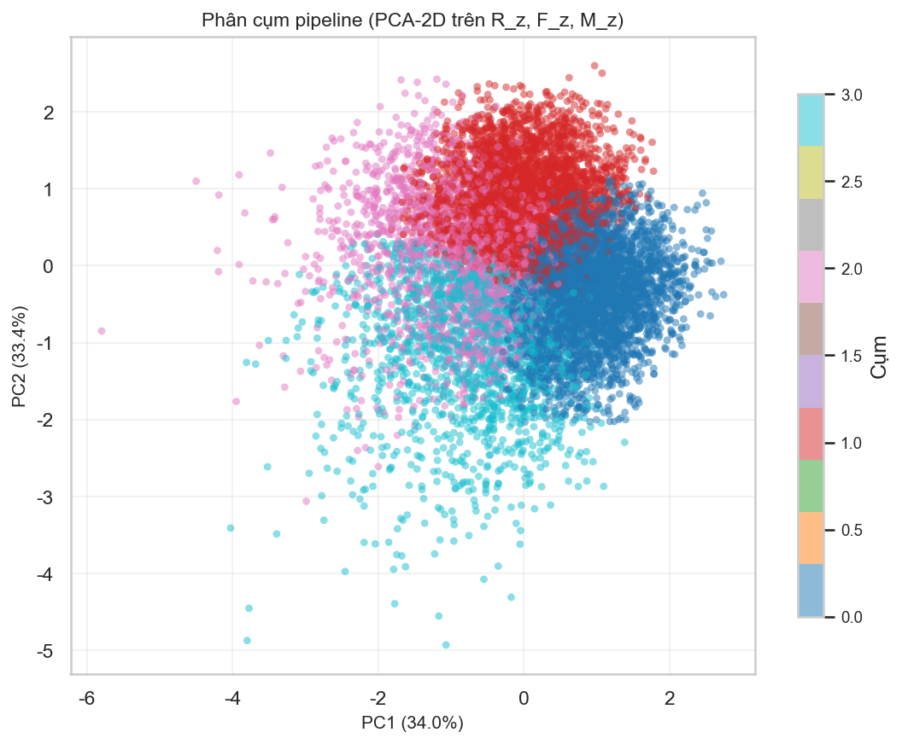

# CHƯƠNG 4 THIẾT KẾ VÀ THỰC NGHIỆM

Chương này trình bày **thiết kế thực nghiệm** và **kết quả định lượng** cho bài toán phân khúc khách hàng theo mô hình RFM, với chuỗi xử lý: làm sạch dữ liệu → xây vector RFM → ước lượng phân phối bằng GMM → lấy mẫu tập con (GMS) → khởi tạo tâm cụm bằng AFK-MC2 trên tập con → phân cụm toàn bộ bằng K-means kiểu Elkan. Nhóm thực hiện **hai luồng song song** trên cùng một codebase notebook: một luồng xuất phát từ **lịch sử giao dịch thô** (hàng trăm nghìn dòng dòng sản phẩm trên hóa đơn), một luồng xuất phát từ **bảng khách đã tổng hợp** (một dòng trên mỗi khách). Việc đặt song song hai nguồn giúp kiểm tra xem pipeline có **ổn định** khi dữ liệu đầu vào thay đổi về mức chi tiết hay không, đồng thời vẫn giữ nguyên các chỉ số đánh giá (SSE, Silhouette, Davies–Bouldin, số vòng lặp K-means) để so sánh công bằng.

Các số liệu tổng hợp trong chương được lấy từ các file CSV sinh ra sau khi chạy notebook (thư mục `data/` và `data_customer/`). **Các biểu đồ** dùng trong báo cáo là hình PNG do notebook `04_KetQuaVaTrucQuan` xuất ra; nếu trong máy bạn chưa thấy file ảnh, hãy chạy lần lượt notebook kết quả tương ứng để tạo lại thư mục `figures/` và `figures_customer/` ở gốc project.

## 4.1. Dataset and Evaluation Metrics

Trong thực nghiệm, **đầu vào** là dữ liệu thô theo đúng định dạng nguồn; **đầu ra trung gian** là các bảng RFM đã chuẩn hóa và mô hình GMM; **đầu ra cuối** là nhãn cụm cho từng khách cùng các bảng so sánh phương pháp khởi tạo. Mục tiêu của đầu ra cuối là phục vụ **ra quyết định marketing** (ưu tiên nhóm giá trị cao, tái kích hoạt nhóm xa rời) và **đánh giá kỹ thuật** (pipeline GMS + AFK-MC2 có cải thiện chất lượng cụm hay tốc độ hội tụ so với K-means++ hay khởi tạo ngẫu nhiên).

```mermaid
flowchart LR
    A[Raw data] --> B[Preprocessing]
    B --> C[Customer-level RFM]
    C --> D[log1p(F, M) + StandardScaler]
    D --> E[GMM fit]
    E --> F[GMS sub-sampling]
    F --> G[AFK-MC2 seeding]
    G --> H[Elkan K-means on full RFM]
    H --> I[Metrics + cluster profiles]
```

### 4.1.1. Tập dữ liệu giao dịch thương mại điện tử — Online Retail II

*Nguồn công khai thường dùng trong nghiên cứu RFM; trong đề tài lưu dưới tên file `online_retail_II.csv`.*

Đây là tập dữ liệu **điển hình cho kho dữ liệu giao dịch thương mại điện tử**: mỗi bản ghi mô tả một dòng hàng trên một hóa đơn, cùng thời điểm mua, số lượng, đơn giá và (nếu có) mã khách hàng. Dạng dữ liệu này phản ánh đúng thực tế vận hành: quy mô lớn, có giao dịch hủy, có dòng thiếu định danh khách, và phải **gom ngược** về cấp khách hàng trước khi tính RFM. Trong báo cáo, nhóm **chốt một quy tắc lọc rõ ràng** (loại khách không định danh, loại hóa đơn hủy, loại dòng có số lượng hoặc giá không dương) để mọi chỉ số RFM sau này đều bám trên các giao dịch “có ý nghĩa kinh tế”, tránh nhiễu từ hoàn tiền hoặc bản ghi lỗi.

| Mục | Mô tả |
|---|---|
| Mức hạt dữ liệu | Giao dịch thô theo từng dòng hóa đơn |
| Kích thước gốc | **1,067,371** dòng, **8** cột |
| Trường chính | `Invoice`, `Quantity`, `InvoiceDate`, `Price`, `Customer ID`, `Country` |
| Đặc điểm dữ liệu gốc | Ghi nhận `243,007` dòng thiếu `Customer ID`, `19,494` hóa đơn hủy (`Invoice` bắt đầu bằng `C`), `25,700` dòng có `Quantity <= 0` hoặc `Price <= 0`, và `34,335` dòng trùng lặp trong bảng thô |
| Tiền xử lý trong notebook | Giữ các dòng có khách hàng định danh, không phải giao dịch hủy, `Quantity > 0`, `Price > 0`, và `InvoiceDate` hợp lệ |
| Dữ liệu sau làm sạch | **805,549** dòng hợp lệ, **36,969** hóa đơn, **5,878** khách hàng, **41** quốc gia |
| Khoảng thời gian giao dịch | `2009-12-01` đến `2011-12-09` |
| Quy ước RFM | `R = t_ref - lần mua gần nhất` (ngày), `F = số Invoice khác nhau`, `M = tổng Quantity × Price` |
| Đầu ra trung gian | `data/rfm_customers.csv`, `data/gmm_model_selection.csv`, `data/kmeans_init_comparison.csv` |

#### Mẫu dữ liệu trước và sau tiền xử lý (Online Retail II)

**Trước tiền xử lý — ví dụ các dòng giao dịch hợp lệ (đúng định dạng nguồn):** mỗi dòng là một SKU trên hóa đơn; chưa có cột giá trị dòng.

| Invoice | StockCode | Quantity | InvoiceDate | Price | Customer ID | Country |
|---|---:|---|---|---:|---:|---|
| 489434 | 85048 | 12 | 2009-12-01 07:45:00 | 6.95 | 13085.0 | United Kingdom |
| 489434 | 79323P | 12 | 2009-12-01 07:45:00 | 6.75 | 13085.0 | United Kingdom |
| 489434 | 79323W | 12 | 2009-12-01 07:45:00 | 6.75 | 13085.0 | United Kingdom |

**Trước tiền xử lý — ví dụ bản ghi bị loại:** nhóm cố tình trích các dòng đại diện cho hai lý do lọc phổ biến: (i) không gán được khách vì thiếu `Customer ID`; (ii) giao dịch hủy / hoàn (mã `Invoice` bắt đầu bằng `C`, thường kèm số lượng âm). Các dòng này **không đưa vào** tính RFM.

| Invoice | Quantity | InvoiceDate | Price | Customer ID | Lý do loại (theo notebook) |
|---|---:|---|---:|---|---|
| 489464 | -96 | 2009-12-01 10:52:00 | 0.0 | *(trống)* | Thiếu `Customer ID`; đồng thời không thỏa điều kiện số lượng/giá dương |
| C489449 | -12 | 2009-12-01 10:33:00 | 2.95 | 16321.0 | Hóa đơn hủy (`C…`); `Quantity` không dương |

**Sau tiền xử lý — cùng mức dòng giao dịch, đã lọc và bổ sung giá trị dòng:** các dòng còn lại dùng để cộng dồn `M` theo khách; `LineTotal = Quantity × Price`.

| Invoice | StockCode | Quantity | InvoiceDate | Price | Customer ID | Country | LineTotal |
|---|---:|---|---|---:|---:|---|---:|
| 489434 | 85048 | 12 | 2009-12-01 07:45:00 | 6.95 | 13085.0 | United Kingdom | 83.40 |
| 489434 | 79323P | 12 | 2009-12-01 07:45:00 | 6.75 | 13085.0 | United Kingdom | 81.00 |
| 489434 | 79323W | 12 | 2009-12-01 07:45:00 | 6.75 | 13085.0 | United Kingdom | 81.00 |

**Sau gom nhóm theo khách — bảng RFM (ví dụ ba khách đầu trong `data/rfm_customers.csv`):** mỗi dòng là một khách; thêm `log1p` cho `F`, `M` và chuẩn hóa z-score để đưa vào GMM/K-means.

| customer_id | R | F | M | F_log1p | M_log1p | R_z | F_z | M_z |
|---:|---:|---:|---:|---:|---:|---:|---:|---:|
| 12346.0 | 325 | 12 | 77556.46 | 2.56 | 11.26 | 0.60 | 1.25 | 3.19 |
| 12347.0 | 1 | 8 | 5633.32 | 2.20 | 8.64 | -0.95 | 0.80 | 1.30 |
| 12348.0 | 74 | 5 | 2019.40 | 1.79 | 7.61 | -0.60 | 0.30 | 0.56 |

**Đầu vào (Input).** File `online_retail_II.csv` ở dạng giao dịch thô, chưa có vector hành vi theo từng cá nhân.

**Đầu ra (Output).** Chuỗi file trong `data/`: bảng RFM + đặc trưng chuẩn hóa, kết quả chọn GMM (AIC/BIC), bảng so sánh khởi tạo K-means, và bảng gán cụm cuối cùng (sau khi chạy đủ notebook 01–04).

**Mục tiêu của output.** (1) Có một **tập khách đã gán cụm** để diễn giải nghiệp vụ; (2) có **bằng chứng số** so sánh pipeline đề xuất với các baseline trên cùng một tập giao dịch thật, tránh kết luận chỉ dựa trực quan.

### 4.1.2. Tập dữ liệu khách hàng marketing đa kênh

*Bảng khách hàng tổng hợp (một dòng / khách), trong đề tài lưu dưới tên file `customer_data.csv`; dùng làm bộ đối chiếu ở mức customer-level.*

Tập này mô phỏng tình huống doanh nghiệp đã **tổng hợp sẵn** hành vi mua: recency, số lần mua theo kênh và tổng chi tiêu nằm ngay trên một dòng khách. Do đó bước “tiền xử lý” không còn là gom từ hàng triệu dòng SKU, mà chủ yếu là **kiểm tra kiểu dữ liệu**, đảm bảo các cột dùng để ghép thành `F` và `M` nhất quán, rồi **ánh xạ trực tiếp** sang RFM theo quy ước đã thống nhất với luồng Online Retail (log1p + StandardScaler). Điều này giúp nhóm tách bạch hai câu hỏi: (a) pipeline có chạy ổn trên dữ liệu “đẹp” cấp khách không; (b) khi chuyển sang dữ liệu giao dịch thô, **cùng một pipeline** có còn giữ được lợi thế hay không.

| Mục | Mô tả |
|---|---|
| Mức hạt dữ liệu | Bảng khách hàng, một dòng trên mỗi khách |
| Kích thước gốc | **10,000** dòng, **42** cột |
| Trường chính (dùng cho RFM) | `Customer_ID`, `Last_Purchase_Recency`, `Web_Purchases`, `Catalog_Purchases`, `Store_Purchases`, `Deals_Purchased`, `Total_Amount_Spent` |
| Thuộc tính bổ sung | `Education_Level`, `Marital_Status`, `Annual_Income`, `Membership_Tier`, `Device_Type`, … |
| Chất lượng dữ liệu gốc | Không có giá trị khuyết thiếu và không ghi nhận dòng trùng lặp |
| Mapping sang RFM | `R = Last_Purchase_Recency`, `F = Web + Catalog + Store + Deals`, `M = Total_Amount_Spent` |
| Dữ liệu sau tiền xử lý | **10,000** khách hợp lệ, **5** quốc gia |
| Đầu ra trung gian | `data_customer/rfm_customers.csv`, `data_customer/gmm_model_selection.csv`, `data_customer/kmeans_init_comparison.csv` |

#### Mẫu dữ liệu trước và sau tiền xử lý (khách hàng đa kênh)

**Trước — ba dòng đầu trong `customer_data.csv` (chỉ hiển thị các cột dùng để dựng RFM và quốc gia):** dữ liệu đã là cấp khách; `F` chưa được tính tổng mà nằm rời rạc theo kênh.

| Customer_ID | Last_Purchase_Recency | Web_Purchases | Catalog_Purchases | Store_Purchases | Deals_Purchased | Total_Amount_Spent | Country |
|---:|---:|---:|---:|---:|---:|---:|---|
| 1 | 68 | 3 | 2 | 2 | 5 | 1265 | Germany |
| 2 | 99 | 1 | 5 | 0 | 6 | 1647 | UK |
| 3 | 63 | 7 | 6 | 5 | 1 | 1806 | Brazil |

**Sau — cùng các khách trong `data_customer/rfm_customers.csv`:** `F` là tổng các kênh (cộng thêm `Deals_Purchased`), `M` lấy trực tiếp từ `Total_Amount_Spent`, kèm biến đổi `log1p` và z-score như luồng Online Retail.

| customer_id | R | F | M | F_log1p | M_log1p | R_z | F_z | M_z |
|---:|---:|---:|---:|---:|---:|---:|---:|---:|
| 1 | 68 | 12 | 1265.0 | 2.56 | 7.14 | 0.63 | -0.95 | -0.29 |
| 2 | 99 | 12 | 1647.0 | 2.56 | 7.41 | 1.70 | -0.95 | 0.56 |
| 3 | 63 | 19 | 1806.0 | 3.00 | 7.50 | 0.46 | 0.31 | 0.85 |

**Đầu vào (Input).** Bảng khách đa thuộc tính `customer_data.csv`.

**Đầu ra (Output).** Cùng họ file như luồng Online Retail nhưng trong `data_customer/`, bảo đảm không ghi đè kết quả tập kia.

**Mục tiêu của output.** So sánh **cùng một pipeline** khi đầu vào ở hai mức chi tiết khác nhau; đồng thời vẫn thu được nhãn cụm để gắn với chiến lược đa kênh (ưu tiên kênh có đóng góp `F` cao trong từng cụm — phần diễn giải sâu hơn có thể mở rộng ngoài phạm vi RFM thuần trong notebook hiện tại).

### 4.1.3. Pipeline thực nghiệm (tóm tắt theo bước)

| Bước | Online Retail II (`online_retail_II.csv`) | Khách hàng đa kênh (`customer_data.csv`) | Đầu ra |
|---|---|---|---|
| 1. Preprocessing | Lọc thiếu `Customer ID`, hóa đơn hủy, giá trị `Quantity` hoặc `Price` không hợp lệ | Kiểm tra kiểu dữ liệu, đảm bảo cột dùng cho RFM hợp lệ | Bảng sạch cho phân tích |
| 2. Tạo RFM | `R = t_ref - max(InvoiceDate)`, `F = #Invoice`, `M = sum(Quantity × Price)` | `R = Last_Purchase_Recency`, `F = Web + Catalog + Store + Deals`, `M = Total_Amount_Spent` | Bảng khách hàng cấp RFM |
| 3. Biến đổi đặc trưng | `log1p(F)`, `log1p(M)` | `log1p(F)`, `log1p(M)` | Giảm lệch phải của `F` và `M` |
| 4. Chuẩn hóa | `StandardScaler` trên `(R, F_log1p, M_log1p)` | `StandardScaler` trên `(R, F_log1p, M_log1p)` | `R_z`, `F_z`, `M_z` |
| 5. GMM model selection | BIC tốt nhất tại **12** thành phần | BIC tốt nhất tại **11** thành phần | Mô hình GMM phục vụ GMS |
| 6. GMS sub-sampling | `sample_rate = 0.5` → **2,939 / 5,878** khách | `sample_rate = 0.5` → **5,000 / 10,000** khách | Tập con bám phân phối GMM |
| 7. AFK-MC2 seeding | `k = 4`, `m = 200` | `k = 4`, `m = 200` | Tâm khởi tạo cho K-means |
| 8. Phân cụm cuối | Elkan K-means trên toàn bộ RFM chuẩn hóa | Elkan K-means trên toàn bộ RFM chuẩn hóa | 4 cụm khách hàng |

### 4.1.4. Chỉ số đánh giá

Các notebook xuất đầy đủ bốn đại lượng dưới đây; nhóm **không báo cáo runtime** vì môi trường phần cứng khác nhau sẽ làm sai lệch số tuyệt đối, trong khi các chỉ số dưới đây vẫn so sánh được trên cùng một lần chạy.

| Chỉ số | Ý nghĩa | Hướng tốt hơn |
|---|---|---|
| `SSE / inertia` | Tổng bình phương khoảng cách trong cụm | Thấp hơn |
| `Silhouette` | Mức tách biệt và gắn kết của cụm | Cao hơn |
| `Davies-Bouldin` | Mức chồng lấn giữa các cụm | Thấp hơn |
| `n_iter` | Số vòng lặp Elkan K-means đến khi hội tụ | Thấp hơn |

*Đường dẫn hình ảnh trong các mục sau dùng dạng `../figures/...` và `../figures_customer/...` (tương đối từ file `notebooks/experiments.md`). Nếu bạn dựng báo cáo từ thư mục gốc project, có thể đổi tương đương thành `figures/...` và `figures_customer/...`.*

## 4.2. Experiment Analysis

Phần này trình bày **kết quả định lượng** sau khi chạy đủ pipeline. Nhóm không chỉ dừng ở một chỉ số: `SSE` phản ánh mức “khớp” của K-means với cấu trúc cụm theo khoảng cách Euclidean, trong khi `Silhouette` và `Davies-Bouldin` bổ sung góc nhìn về **độ tách cụm**; `n_iter` cho biết sau khi khởi tạo, thuật toán Lloyd/Elkan cần bao nhiêu vòng để ổn định — đây là chi phí tính toán trực tiếp liên quan đến seeding. Các biểu đồ cột trong hình `so_sanh_metric_phuong_phap.png` (mỗi tập dữ liệu một bản trong thư mục hình tương ứng) tổng hợp trực quan bốn đại lượng này cho bốn cách khởi tạo đã cài đặt trong notebook `03`.

### 4.2.1. Online Retail II — so sánh phương pháp

| Phương pháp | SSE | Silhouette | Davies-Bouldin | `n_iter` |
|---|---:|---:|---:|---:|
| GMS + AFK-MC2 (sub) + K-means (full) | **4468.915** | 0.3616 | **0.8920** | **6** |
| AFK-MC2 (full) + K-means | 4785.252 | **0.3844** | 0.9279 | 16 |
| K-means++ | 4469.007 | 0.3614 | 0.8934 | 16 |
| K-means (random init) | 4468.961 | 0.3615 | 0.8928 | 12 |

Trên tập giao dịch thật, pipeline **GMS + AFK-MC2** đạt `SSE` và `Davies-Bouldin` tốt nhất trong bảng, đồng thời **`n_iter` nhỏ nhất (6)** — nghĩa là sau khi có seed từ tập con, K-means trên toàn bộ dữ liệu hội tụ rất nhanh. Điều này phù hợp với động lực thực nghiệm: khi dữ liệu lớn và lệch phân phối, một seed “đủ tốt” có thể giúp giảm số vòng Lloyd. Ngược lại, **AFK-MC2 chạy trực tiếp trên toàn bộ tập** cho `Silhouette` cao nhất nhưng `SSE` xấu hơn rõ — gợi ý rằng thước đo hình học của Silhouette và mục tiêu tối ưu SSE không luôn đồng hướng; trong báo cáo ứng dụng, nhóm vẫn ưu tiên nhìn **cả bộ chỉ số** và hồ sơ cụm (mục 4.3). **K-means++** gần như bằng pipeline GMS về `SSE` nhưng cần nhiều vòng lặp hơn.


*Hình 1. So sánh bốn phương pháp khởi tạo trên tập Online Retail II (nguồn: `figures/so_sanh_metric_phuong_phap.png`).*


*Hình 2. Cơ cấu phần trăm khách theo từng cụm khi đổi cách khởi tạo; giúp thấy một số phương pháp hoán đổi “nhãn cụm” nhưng tỷ lệ có thể khác nhau (nguồn: `figures/heatmap_co_cau_cum_theo_phuong_phap.png`).*

### 4.2.2. Khách hàng đa kênh — so sánh phương pháp

| Phương pháp | SSE | Silhouette | Davies-Bouldin | `n_iter` |
|---|---:|---:|---:|---:|
| GMS + AFK-MC2 (sub) + K-means (full) | 13766.297 | 0.2860 | 1.0568 | **14** |
| AFK-MC2 (full) + K-means | 13763.821 | 0.2862 | 1.0572 | 27 |
| K-means++ | **13763.667** | **0.2864** | 1.0563 | 18 |
| K-means (random init) | 13763.727 | 0.2864 | **1.0562** | 21 |

Ở mức dữ liệu đã tổng hợp theo khách, **chênh lệch SSE và các chỉ số hình dạng cụm giữa các phương pháp rất nhỏ** (sai khác chỉ ở phần thập phân). Điều này cho thấy không gian RFM sau chuẩn hóa tương đối “trơn”, các cực tiểu địa phương của K-means gần nhau. Trong bối cảnh đó, **lợi ích nổi bật của GMS + AFK-MC2 là `n_iter` thấp hơn** (14 so với 18–27), phù hợp khi cần lặp lại thí nghiệm nhiều lần hoặc nhúng pipeline vào luồng batch. Kết luận thực nghiệm: trên tập đa kênh, pipeline đề xuất **cạnh tranh về chất lượng** và **rõ rệt về tốc độ hội tụ**.



*Hình 3. So sánh bốn phương pháp trên `customer_data` (nguồn: `figures_customer/so_sanh_metric_phuong_phap.png`).*



*Hình 4. Cơ cấu cụm theo phương pháp — `customer_data` (nguồn: `figures_customer/heatmap_co_cau_cum_theo_phuong_phap.png`).*

### 4.2.3. Tổng hợp chéo hai tập dữ liệu

| Thành phần | Online Retail II | Khách hàng đa kênh |
|---|---|---|
| Quy mô RFM | 5,878 khách | 10,000 khách |
| GMM (BIC tối ưu trong grid đã chạy) | 12 thành phần | 11 thành phần |
| Tập con GMS (`rate = 0.5`) | 2,939 điểm | 5,000 điểm |
| Nhận xét chất lượng | GMS + AFK-MC2 nhỉnh về `SSE`, `DBI` | Các phương pháp gần tương đương về `SSE` / Silhouette / DBI |
| Nhận xét hội tụ | GMS + AFK-MC2 cho `n_iter` nhỏ nhất | GMS + AFK-MC2 cho `n_iter` nhỏ nhất |

## 4.3. Customer Segmentation and Application

Sau khi chốt nhãn cụm từ pipeline chính **GMS + AFK-MC2 (sub) + K-means (full)** với `k = 4`, nhóm diễn giải từng cụm bằng **thống kê mô tả RFM** (trung bình, và trong báo cáo chi tiết có thể thêm trung vị từ CSV). Các hình heatmap, boxplot và PCA-2D không thay thế bảng số nhưng giúp **độc giả hình dung phân tầng**: heatmap cho thấy cụm nào “nóng” theo chiều nào sau khi chuẩn hóa theo cột; boxplot cho thấy độ phân tán trong cụm; PCA là chiếu trực quan (không dùng làm đầu vào phân cụm). Phần “Ứng dụng” dưới mỗi bảng là **gợi ý chiến lược**, có thể điều chỉnh theo ngữ cảnh doanh nghiệp.

### 4.3.1. Online Retail II — hồ sơ cụm và gợi ý nghiệp vụ


*Hình 5. Phân bổ quy mô cụm (Online Retail II).*


*Hình 6. So sánh RFM (z-score theo cột) giữa các cụm.*


*Hình 7. Phân tán hành vi trong từng cụm.*


*Hình 8. Chiếu hai chiều đầu tiên của PCA — chỉ để trực quan.*

| Cụm | Tỷ trọng | R, F, M (trung bình) | Nhãn gợi ý | Ứng dụng gợi ý |
|---|---:|---|---|---|
| Cụm 3 | 16.23% | R 41.51, F 22.35, M 13227.60 | VIP / Champions | Ưu đãi cao cấp, chăm sóc riêng, cross-sell giá trị cao |
| Cụm 1 | 32.19% | R 97.33, F 5.50, M 1925.45 | Khách ổn định | Loyalty, bundle, tăng giá trị giỏ hàng |
| Cụm 0 | 23.66% | R 104.96, F 1.74, M 428.08 | Mua ít, giá trị thấp | Nhắc mua lại, khuyến mãi nhẹ, onboarding lần 2 |
| Cụm 2 | 27.92% | R 492.27, F 1.73, M 539.84 | Ngủ đông / rủi ro rời bỏ | Win-back, email tái kích hoạt, kiểm soát chi phí remarketing |

Trên dữ liệu giao dịch thật, trục **Monetary** phân hóa mạnh nên cụm VIP nổi bật rõ trong cả heatmap và boxplot; đây là cơ sở để ưu tiên ngân sách giữ chân đúng nhóm.

### 4.3.2. Khách hàng đa kênh — hồ sơ cụm và gợi ý nghiệp vụ



*Hình 9. Phân bổ quy mô cụm (`customer_data`).*



*Hình 10. Heatmap RFM theo cụm — `customer_data`.*



*Hình 11. Phân bố RFM theo cụm — `customer_data`.*



*Hình 12. PCA-2D — `customer_data`.*

| Cụm | Tỷ trọng | R, F, M (trung bình) | Nhãn gợi ý | Ứng dụng gợi ý |
|---|---:|---|---|---|
| Cụm 0 | 33.81% | R 22.87, F 19.55, M 1610.28 | Hoạt động tốt, giá trị cao | Giữ chân đa kênh, sản phẩm mới, tối ưu trải nghiệm |
| Cụm 1 | 31.65% | R 77.00, F 20.00, M 1592.07 | Từng tốt, đang xa dần | Win-back sớm, ưu đãi quay lại |
| Cụm 2 | 18.54% | R 49.00, F 18.87, M 888.50 | Phổ thông / trung bình | Combo, tăng giá trị đơn |
| Cụm 3 | 16.00% | R 52.52, F 9.56, M 1467.01 | Chi tiêu cao, mua thưa | Kích thích tần suất, chiến dịch theo chu kỳ |

So với Online Retail II, khoảng biến thiên **M** trên tập đa kênh hẹp hơn (thể hiện qua boxplot), phù hợp với quan sát ở mục 4.2: các phương pháp seeding cho metric gần nhau; **giá trị thực tiễn của pipeline** nghiêng về **ổn định quy trình và tốc độ hội tụ**, trong khi phân khúc vẫn đủ khác biệt để gán chiến lược theo cụm.
